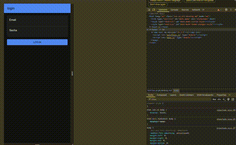

# 🎲 Dice & Dealers

## ✨ Visão Geral

Dice & Dealers é um app mobile de rolagem de dados com animação 3D, persistência de histórico e autenticação de usuários. Ideal para jogos, estudos estatísticos ou diversão.

> "Role seus dados, registre sua sorte, acompanhe seu histórico."

---
### Imagem da Interface:


---
## 📱 Aplicativo Mobile

### Funcionalidades:

- Rolar dado d6 com botão ou movimento
- Animação 3D realista do dado
- Histórico de rolagens
- Edição e exclusão de resultados
- Login/logout com token JWT
- Interface com abas (Rolls, Histórico, Perfil)

### Tecnologias:

- Ionic + Angular
- Cordova Device Motion
- Storage local com `@ionic/storage-angular`
- Integração com API Express + MongoDB

### Instalação:

```bash
npm install -g @ionic/cli
npm install
ionic serve
```

### Gerar APK:

```bash
ionic capacitor build android
```

---